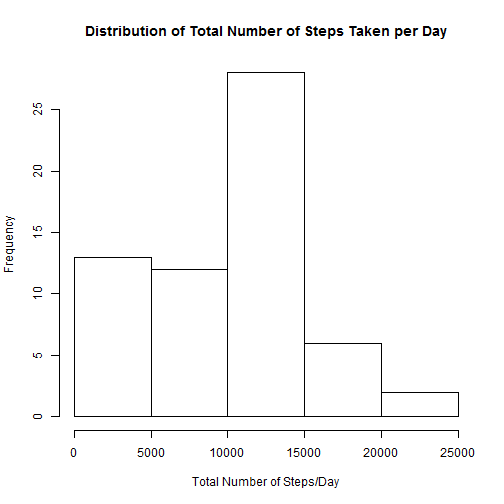
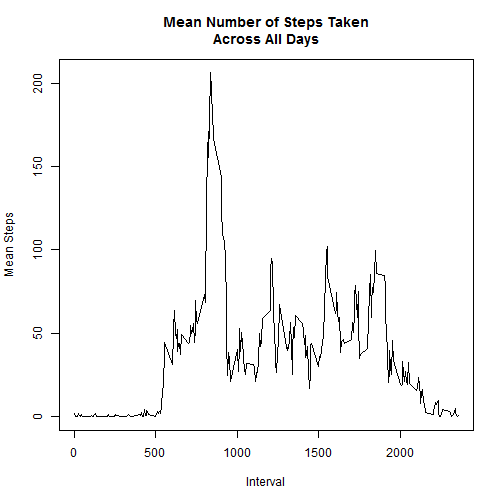
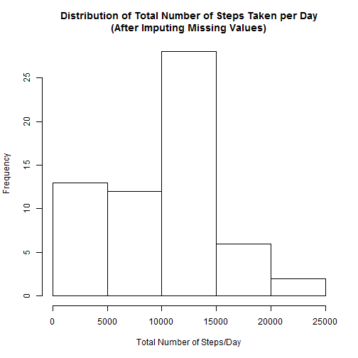
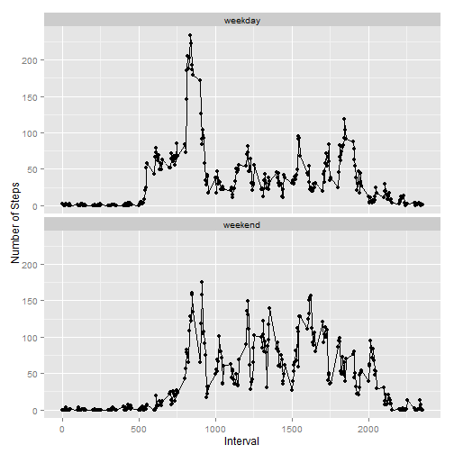

===============================================================================================

####Loading and preprocessing the data
Below are the codes used to load the data as well as the necessary libraries used in this analysis

```r
rm(list=ls())
setwd("C:\\Users\\AntoniRiady\\Dropbox\\Projects\\Coursera\\Reproducible Research\\Assignment 1")
library(dplyr)
library(lattice)
library(ggplot2)
data <-read.csv("activity.csv")
```
Grouping the data based on dates and intervals..

```r
data_by_date<-group_by(data,date)
data_by_interval<-group_by(data,interval)
```

####What is mean total number of steps taken per day?
1. Calculate the total number of steps taken per day

```r
sum_data_by_date<-summarize(data_by_date,sum(steps,na.rm=TRUE))
names(sum_data_by_date)<-c("Date","Sum")
sum_data_by_date
```

```
## Source: local data frame [61 x 2]
## 
##          Date   Sum
## 1  2012-10-01     0
## 2  2012-10-02   126
## 3  2012-10-03 11352
## 4  2012-10-04 12116
## 5  2012-10-05 13294
## 6  2012-10-06 15420
## 7  2012-10-07 11015
## 8  2012-10-08     0
## 9  2012-10-09 12811
## 10 2012-10-10  9900
## ..        ...   ...
```
2. If you do not understand the difference between a histogram and a barplot, research the difference between them. Make a histogram of the total number of steps taken each day

```r
hist(sum_data_by_date$Sum,data=sum_data_by_date,xlab="Total Number of Steps/Day",main="Distribution of Total Number of Steps Taken per Day")
```

 


3.Calculate and report the mean and median of the total number of steps taken per day

```r
mean_data_by_date<-summarize(data_by_date,mean(steps,na.rm=TRUE))
names(mean_data_by_date)<-c("Date","Mean")
mean_data_by_date
```

```
## Source: local data frame [61 x 2]
## 
##          Date     Mean
## 1  2012-10-01      NaN
## 2  2012-10-02  0.43750
## 3  2012-10-03 39.41667
## 4  2012-10-04 42.06944
## 5  2012-10-05 46.15972
## 6  2012-10-06 53.54167
## 7  2012-10-07 38.24653
## 8  2012-10-08      NaN
## 9  2012-10-09 44.48264
## 10 2012-10-10 34.37500
## ..        ...      ...
```

```r
median_data_by_date<-summarize(data_by_date,median(steps,na.rm=TRUE))
names(median_data_by_date)<-c("Date","Median")
median_data_by_date
```

```
## Source: local data frame [61 x 2]
## 
##          Date Median
## 1  2012-10-01     NA
## 2  2012-10-02      0
## 3  2012-10-03      0
## 4  2012-10-04      0
## 5  2012-10-05      0
## 6  2012-10-06      0
## 7  2012-10-07      0
## 8  2012-10-08     NA
## 9  2012-10-09      0
## 10 2012-10-10      0
## ..        ...    ...
```

####What is the average daily activity pattern?
1. Make a time series plot (i.e. type = "l") of the 5-minute interval (x-axis) and the average number of steps taken, averaged across all days (y-axis)

```r
mean_data_by_interval<-summarize(data_by_interval,mean(steps,na.rm=TRUE))
names(mean_data_by_interval)<-c("Interval","Mean")
plot(mean_data_by_interval$Interval,mean_data_by_interval$Mean,type="l",xlab="Interval",ylab="Mean Steps",main="Mean Number of Steps Taken\nAcross All Days")
```

 


2. Which 5-minute interval, on average across all the days in the dataset, contains the maximum number of steps?

```r
mean_data_by_interval[mean_data_by_interval$Mean>=max(mean_data_by_interval$Mean),"Interval"]
```

```
## Source: local data frame [1 x 1]
## 
##   Interval
## 1      835
```

####Imputing missing values
1. Calculate and report the total number of missing values in the dataset (i.e. the total number of rows with NAs)

```r
sum(!complete.cases(data))
```

```
## [1] 2304
```
2. & 3. Devise a strategy for filling in all of the missing values in the dataset. The strategy does not need to be sophisticated. For example, you could use the mean/median for that day, or the mean for that 5-minute interval, etc.

Create a new dataset that is equal to the original dataset but with the missing data filled in.

```r
#replacing NA values with 0
data_edited<-data%>%mutate(steps=ifelse(is.na(steps),0,steps))
data_by_date_edited<-group_by(data_edited,date)
sum_data_by_date_edited<-summarize(data_by_date_edited,sum(steps,na.rm=TRUE))
names(sum_data_by_date_edited)<-c("Date","Sum")
```
4. Make a histogram of the total number of steps taken each day 

```r
hist(sum_data_by_date_edited$Sum,data=sum_data_by_date_edited,xlab="Total Number of Steps/Day",main="Distribution of Total Number of Steps Taken per Day\n(After Imputing Missing Values)")
```

 


and Calculate and report the mean and median total number of steps taken per day. 

```r
mean_data_by_date_edited<-summarize(data_by_date_edited,mean(steps,na.rm=TRUE))
names(mean_data_by_date_edited)<-c("Date","Mean")
mean_data_by_date_edited
```

```
## Source: local data frame [61 x 2]
## 
##          Date     Mean
## 1  2012-10-01  0.00000
## 2  2012-10-02  0.43750
## 3  2012-10-03 39.41667
## 4  2012-10-04 42.06944
## 5  2012-10-05 46.15972
## 6  2012-10-06 53.54167
## 7  2012-10-07 38.24653
## 8  2012-10-08  0.00000
## 9  2012-10-09 44.48264
## 10 2012-10-10 34.37500
## ..        ...      ...
```

```r
median_data_by_date_edited<-summarize(data_by_date_edited,median(steps,na.rm=TRUE))
names(median_data_by_date_edited)<-c("Date","Median")
median_data_by_date_edited
```

```
## Source: local data frame [61 x 2]
## 
##          Date Median
## 1  2012-10-01      0
## 2  2012-10-02      0
## 3  2012-10-03      0
## 4  2012-10-04      0
## 5  2012-10-05      0
## 6  2012-10-06      0
## 7  2012-10-07      0
## 8  2012-10-08      0
## 9  2012-10-09      0
## 10 2012-10-10      0
## ..        ...    ...
```

Do these values differ from the estimates from the first part of the assignment? What is the impact of imputing missing data on the estimates of the total daily number of steps?

```r
mean_data_by_date_before<-mean_data_by_date
names(mean_data_by_date_before)<-c("Date","Mean Before")
merge(mean_data_by_date_before,mean_data_by_date_edited)
```

```
##          Date Mean Before       Mean
## 1  2012-10-01         NaN  0.0000000
## 2  2012-10-02   0.4375000  0.4375000
## 3  2012-10-03  39.4166667 39.4166667
## 4  2012-10-04  42.0694444 42.0694444
## 5  2012-10-05  46.1597222 46.1597222
## 6  2012-10-06  53.5416667 53.5416667
## 7  2012-10-07  38.2465278 38.2465278
## 8  2012-10-08         NaN  0.0000000
## 9  2012-10-09  44.4826389 44.4826389
## 10 2012-10-10  34.3750000 34.3750000
## 11 2012-10-11  35.7777778 35.7777778
## 12 2012-10-12  60.3541667 60.3541667
## 13 2012-10-13  43.1458333 43.1458333
## 14 2012-10-14  52.4236111 52.4236111
## 15 2012-10-15  35.2048611 35.2048611
## 16 2012-10-16  52.3750000 52.3750000
## 17 2012-10-17  46.7083333 46.7083333
## 18 2012-10-18  34.9166667 34.9166667
## 19 2012-10-19  41.0729167 41.0729167
## 20 2012-10-20  36.0937500 36.0937500
## 21 2012-10-21  30.6284722 30.6284722
## 22 2012-10-22  46.7361111 46.7361111
## 23 2012-10-23  30.9652778 30.9652778
## 24 2012-10-24  29.0104167 29.0104167
## 25 2012-10-25   8.6527778  8.6527778
## 26 2012-10-26  23.5347222 23.5347222
## 27 2012-10-27  35.1354167 35.1354167
## 28 2012-10-28  39.7847222 39.7847222
## 29 2012-10-29  17.4236111 17.4236111
## 30 2012-10-30  34.0937500 34.0937500
## 31 2012-10-31  53.5208333 53.5208333
## 32 2012-11-01         NaN  0.0000000
## 33 2012-11-02  36.8055556 36.8055556
## 34 2012-11-03  36.7048611 36.7048611
## 35 2012-11-04         NaN  0.0000000
## 36 2012-11-05  36.2465278 36.2465278
## 37 2012-11-06  28.9375000 28.9375000
## 38 2012-11-07  44.7326389 44.7326389
## 39 2012-11-08  11.1770833 11.1770833
## 40 2012-11-09         NaN  0.0000000
## 41 2012-11-10         NaN  0.0000000
## 42 2012-11-11  43.7777778 43.7777778
## 43 2012-11-12  37.3784722 37.3784722
## 44 2012-11-13  25.4722222 25.4722222
## 45 2012-11-14         NaN  0.0000000
## 46 2012-11-15   0.1423611  0.1423611
## 47 2012-11-16  18.8923611 18.8923611
## 48 2012-11-17  49.7881944 49.7881944
## 49 2012-11-18  52.4652778 52.4652778
## 50 2012-11-19  30.6979167 30.6979167
## 51 2012-11-20  15.5277778 15.5277778
## 52 2012-11-21  44.3993056 44.3993056
## 53 2012-11-22  70.9270833 70.9270833
## 54 2012-11-23  73.5902778 73.5902778
## 55 2012-11-24  50.2708333 50.2708333
## 56 2012-11-25  41.0902778 41.0902778
## 57 2012-11-26  38.7569444 38.7569444
## 58 2012-11-27  47.3819444 47.3819444
## 59 2012-11-28  35.3576389 35.3576389
## 60 2012-11-29  24.4687500 24.4687500
## 61 2012-11-30         NaN  0.0000000
```

```r
median_data_by_date_before<-median_data_by_date
names(median_data_by_date_before)<-c("Date","Median Before")
merge(median_data_by_date_before,median_data_by_date_edited)
```

```
##          Date Median Before Median
## 1  2012-10-01            NA      0
## 2  2012-10-02             0      0
## 3  2012-10-03             0      0
## 4  2012-10-04             0      0
## 5  2012-10-05             0      0
## 6  2012-10-06             0      0
## 7  2012-10-07             0      0
## 8  2012-10-08            NA      0
## 9  2012-10-09             0      0
## 10 2012-10-10             0      0
## 11 2012-10-11             0      0
## 12 2012-10-12             0      0
## 13 2012-10-13             0      0
## 14 2012-10-14             0      0
## 15 2012-10-15             0      0
## 16 2012-10-16             0      0
## 17 2012-10-17             0      0
## 18 2012-10-18             0      0
## 19 2012-10-19             0      0
## 20 2012-10-20             0      0
## 21 2012-10-21             0      0
## 22 2012-10-22             0      0
## 23 2012-10-23             0      0
## 24 2012-10-24             0      0
## 25 2012-10-25             0      0
## 26 2012-10-26             0      0
## 27 2012-10-27             0      0
## 28 2012-10-28             0      0
## 29 2012-10-29             0      0
## 30 2012-10-30             0      0
## 31 2012-10-31             0      0
## 32 2012-11-01            NA      0
## 33 2012-11-02             0      0
## 34 2012-11-03             0      0
## 35 2012-11-04            NA      0
## 36 2012-11-05             0      0
## 37 2012-11-06             0      0
## 38 2012-11-07             0      0
## 39 2012-11-08             0      0
## 40 2012-11-09            NA      0
## 41 2012-11-10            NA      0
## 42 2012-11-11             0      0
## 43 2012-11-12             0      0
## 44 2012-11-13             0      0
## 45 2012-11-14            NA      0
## 46 2012-11-15             0      0
## 47 2012-11-16             0      0
## 48 2012-11-17             0      0
## 49 2012-11-18             0      0
## 50 2012-11-19             0      0
## 51 2012-11-20             0      0
## 52 2012-11-21             0      0
## 53 2012-11-22             0      0
## 54 2012-11-23             0      0
## 55 2012-11-24             0      0
## 56 2012-11-25             0      0
## 57 2012-11-26             0      0
## 58 2012-11-27             0      0
## 59 2012-11-28             0      0
## 60 2012-11-29             0      0
## 61 2012-11-30            NA      0
```
As we can see from the table above, no impact of imputing missing data since the NA values are perfectly grouped by days

####Are there differences in activity patterns between weekdays and weekends?
1. Create a new factor variable in the dataset with two levels - "weekday" and "weekend" indicating whether a given date is a weekday or weekend day.

```r
data_weekday<-data
data_weekday$is_weekday<-NA
data_weekday<-data_weekday%>%mutate(is_weekday=ifelse(weekdays(as.Date(date))=="Saturday"|weekdays(as.Date(date))=="Sunday","weekend","weekday"))
data_weekday_grouped<-group_by(data_weekday,interval,is_weekday)
mean_data_by_weekday<-summarize(data_weekday_grouped,mean(steps,na.rm=TRUE))
names(mean_data_by_weekday)<-c("Interval","Is_Weekday","Mean_Steps")
mean_data_by_weekday
```

```
## Source: local data frame [576 x 3]
## Groups: interval
## 
##    Interval Is_Weekday Mean_Steps
## 1         0    weekday  2.3333333
## 2         0    weekend  0.0000000
## 3         5    weekday  0.4615385
## 4         5    weekend  0.0000000
## 5        10    weekday  0.1794872
## 6        10    weekend  0.0000000
## 7        15    weekday  0.2051282
## 8        15    weekend  0.0000000
## 9        20    weekday  0.1025641
## 10       20    weekend  0.0000000
## ..      ...        ...        ...
```
2. Make a panel plot containing a time series plot (i.e. type = "l") of the 5-minute interval (x-axis) and the average number of steps taken, averaged across all weekday days or weekend days (y-axis). See the README file in the GitHub repository to see an example of what this plot should look like using simulated data.

```r
ggplot(mean_data_by_weekday,aes(Interval,Mean_Steps))+geom_line()+geom_point()+facet_wrap(~Is_Weekday,nrow=2,ncol=1)+ylab("Number of Steps")+xlab("Interval")
```

 


As we can see from the chart above, there is noticeable difference between activity patterns during weekdays vs during weekends
